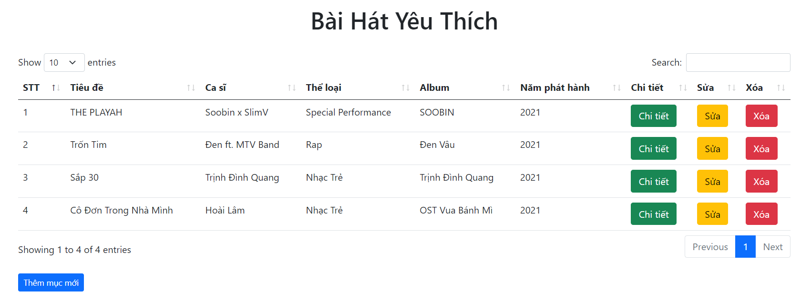

# pdo-mvc
Simple CRUD using MVC(Model-Viewer-Controller) which is implement OOP Concept,PDO and Bootstrap

Access url using : localhost:(port-number)/music (View all list music)
and don't forget to import this database : db.sql on mysql,mariadb,etc

## Required
* PHP 5.0 or PHP 7
* WAMPP,XAMPP,etc

## Results
CRUD Menu and Viewer List 
